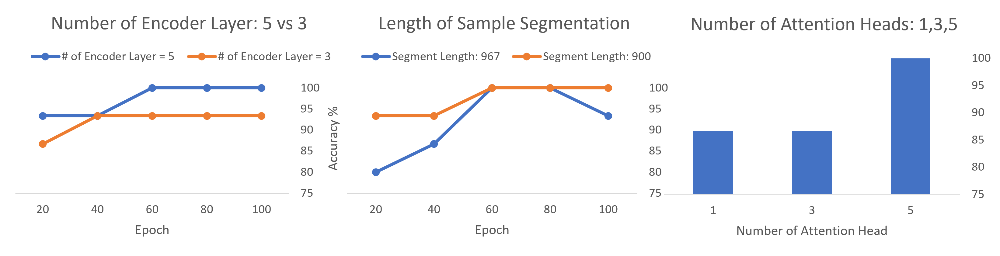
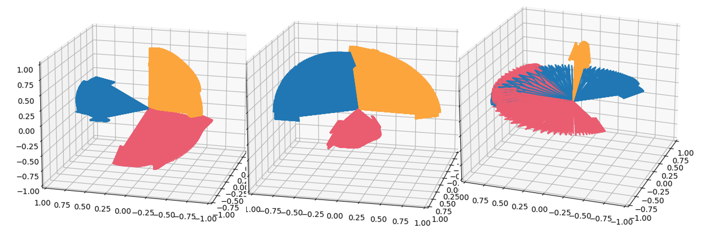
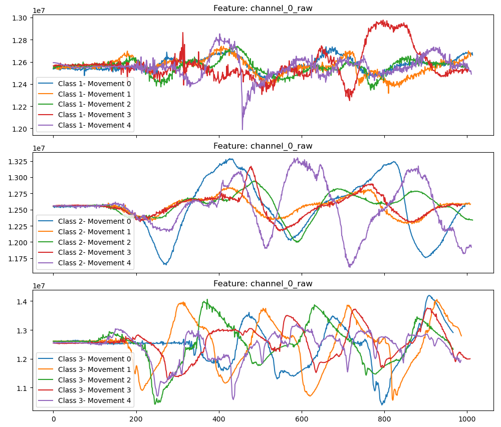

## Transformer Encoder with Temporal Convolutions for Wrist Motion Classification

## Report [Transformer Encoder with Temporal Convolutions for Wrist Motion Classification](https://github.com/zhenyuanlu/WristMotion-Pison/blob/main/report/PisonWrist.pdf)

### Models adapted from our paper [Transformer Encoder with Multiscale Deep Learning for Pain Classification Using Physiological Signals](https://arxiv.org/pdf/2303.06845.pdf) 

<br/>

## Abstract

<div style="text-align:center">
  
</div>

<br>

In this project, we adapt our [PainAttnNet Model](https://github.com/zhenyuanlu/PainAttnNet) on Pison's Wrist Multimodal Motion data. This model integrates multiscale convolutional networks to capture short- and long-window sequential features, a squeeze-and-excitation residual network emphasizing interdependencies among relevant features, and a transformer encoder block for optimal feature extraction and temporal dependency analysis.

<br>

<div style="text-align:center">
  
</div>

<br>

In our experiment, we used the PWMD for modeling. This dataset consists of 17 columns provided in the dataset. 14 of them are features we used in our model for prediction of the repetition number (wrist motion), e.g. {1, 2, 3} among body movements. The results with different settings showed in above figures. We have the best performance with the following settings: 5 encoder layers, 5 attention heads, and minimum length 967. **The performance is 100\% accuracy, 100\% macro F1, and 100\% Cohen's Kappa.**

<br>

<div style="text-align:center">
  
</div>

<div style="text-align:center">
  
</div>

## Directory Structure
```python
PainAttnNet
|   environment.yml # Requirements for conda environment
|   LICENSE
|   README.md
|   requirments.txt # Requirements for pip environment
|          
+---jq
|       jq-win64.exe
|       
\---src
    |   batch_train.sh # Training script
    |   config.json # Training configurations
    |   logger_config.json # Logger configurations
    |   parser.py # Parser for training configurations
    |   train_kfold_cv.py # Main training script
    |   __init__.py
    |   
    +---models* (Main modules)
    |   |   main_PAN.py # Main model wrapper
    |   |   module_mscn.py # Convolutional network
    |   |   module_se_resnet.py # Squeeze-and-excitation residual network
    |   |   module_transformer_encoder.py # Transformer encoder block
    |   |   __init__.py
    |    
    +---trainers # Training modules
    |   |   checkpoint_handler.py # Checkpoint handler
    |   |   device_prep.py # Device preparation, CPU or GPU
    |   |   main_trainer.py # Main trainer scripts
    |   |   metrics_manager.py # Metrics manager and other metrics functions
    |   |   __init__.py
    |           
    +---utils
    |   |   process_pison.py # Data processing for Pison Wrist Motion Data
    |   |   utils.py # Other utility functions
    |   |   __init__.py


```            
## Main Modules

### Convolutional Network
`module_mscn.py` contains the convolutional network. The network consists of convolutional layers to extract input features. 

### Squeeze-and-excitation residual network
`module_se_resnet.py` Squeeze-and-Excitation Residual Network (SEResNet) to learn the interdependencies among the extracted features to enhance the representation capability of the features. SEResNet consist of two main components: a squeeze operation, which reduces the number of channels in the feature maps by taking their spatial average, and an excitation operation, which scales the channel-wise feature maps using a weighted sum of the squeezed features. This allows the network to selectively weight the importance of different channels and adaptively recalibrate the feature maps.

### Transformer encoder block
`module_transformer_encoder.py` to capture the temporal representations of the extracted features, we use a multi-head attention mechanism in conjunction with a temporal (causal) convolutional network. The multi-head attention mechanism allows the network to attend to different parts of the input sequence simultaneously, and the temporal convolution network effectively captures the dependencies between the input and output over time. The mechanism behind the multi-head attention rests on the idea of scaling the dot product of the query and key vectors by the square root of their dimensionality, followed by a weighted sum of the values using the scaled dot products as weights. This mechanism allows the network to attend to different parts of the input sequence in a parallel fashion. On the other hand, the temporal convolution network uses an auto-regressive operation to effectively capture the dependencies between the sequence over time, while also allowing the end-to-end network training.

### Main model wrapper
`main_PAN.py` is to wrap the above modules into a single model. The model consists of a convolutional network, a squeeze-and-excitation residual network, and a transformer encoder block. 


## Get Started

```
torchaudio==0.13.0
python==3.10.8
pytorch-cuda==11.7
pytorch==1.13.0
torchvision==0.14.0
scikit-learn==1.0.1
pandas
matplotlib
openpyxl
(for linux users) jq package
```
For Windows users, install `jq` package from [here](https://stedolan.github.io/jq/download/), and put the `jq.exe` file in the local directory.


## Training


### Training k-fold cross validation with script
```
sh batch_train.sh
```
### Training individual fold in terminal
```
python train_kfold_cv.py --fold_i {fold index}
```

You can change settings at `main_PAN.py` for tuning model structure, `config.py` for training configurations and `train_kfold_cv.py` for others.


## Dataset
Pison Wrist Motion Data. 

## Reference

[PainAttnNet Model](https://github.com/zhenyuanlu/PainAttnNet), Zhenyuan Lu, et al. "PainAttnNet: Transformer Encoder with Multiscale Deep Learning for Pain Classification Using Physiological Signals." (2023).

