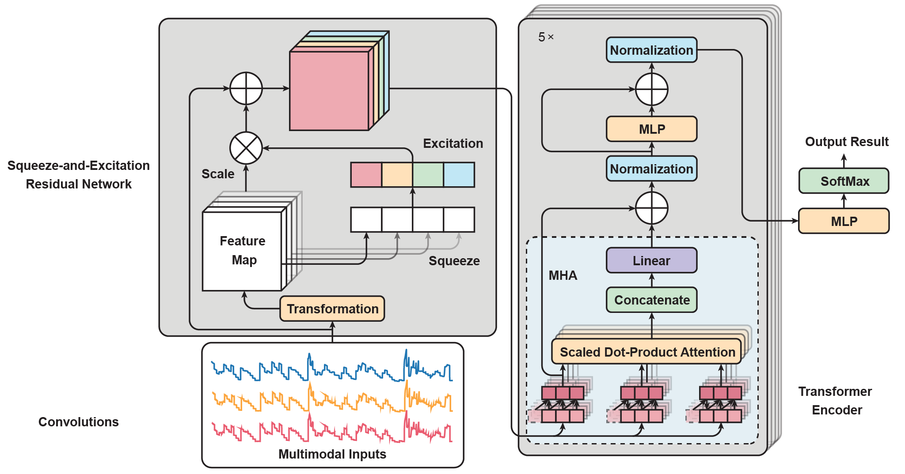

## Transformer Encoder with Temporal Convolutions for Wrist Motion Classification

## Report
[Transformer Encoder with Temporal Convolutions for Wrist Motion Classification](https://github.com/zhenyuanlu/WristMotion-Pison/blob/main/report/PisonWrist.pdf)

<br/>

## Abstract


<div style="text-align:center">
  
</div>

<br>

In this project, we adapt our [PAN Model](https://github.com/zhenyuanlu/PainAttnNet) on Pison's Wrist Multimodal Motion data. This model integrates multiscale convolutional networks to capture short- and long-window sequential features, a squeeze-and-excitation residual network emphasizing interdependencies among relevant features, and a transformer encoder block for optimal feature extraction and temporal dependency analysis.


## Directory Structure
```python
PainAttnNet
|   environment.yml # Requirements for conda environment
|   LICENSE
|   README.md
|   requirments.txt # Requirements for pip environment
|          
+---jq
|       jq-win64.exe
|       
\---src
    |   batch_train.sh # Training script
    |   config.json # Training configurations
    |   logger_config.json # Logger configurations
    |   parser.py # Parser for training configurations
    |   train_kfold_cv.py # Main training script
    |   __init__.py
    |   
    +---models
    |   |   main_painAttnNet.py # Main model wrapper
    |   |   module_mscn.py* # Convolutional network
    |   |   module_se_resnet.py # Squeeze-and-excitation residual network
    |   |   module_transformer_encoder.py # Transformer encoder block
    |   |   __init__.py
    |    
    +---trainers # Training modules
    |   |   checkpoint_handler.py # Checkpoint handler
    |   |   device_prep.py # Device preparation, CPU or GPU
    |   |   main_trainer.py # Main trainer scripts
    |   |   metrics_manager.py # Metrics manager and other metrics functions
    |   |   __init__.py
    |           
    +---utils
    |   |   process_pison.py # Data processing for Pison Wrist Motion Data
    |   |   utils.py # Other utility functions
    |   |   __init__.py

```            


## Get Started

```
torchaudio==0.13.0
python==3.10.8
pytorch-cuda==11.7
pytorch==1.13.0
torchvision==0.14.0
scikit-learn==1.0.1
pandas
matplotlib
openpyxl
(for linux users) jq package
```
For Windows users, install `jq` package from [here](https://stedolan.github.io/jq/download/), and put the `jq.exe` file in the local directory.


## Training


### Training k-fold cross validation with script
```
sh batch_train.sh
```
### Training individual fold in terminal
```
python train_kfold_cv.py --fold_i {fold index}
```

You can change settings at `main_painAttnNet.py` for tuning model structure, `config.py` for training configurations and `train_kfold_cv.py` for others.


## Dataset
Pison Wrist Motion Data. 

## Reference

[PAN Model](https://github.com/zhenyuanlu/PainAttnNet), Zhenyuan Lu, et al. "PainAttnNet: Transformer Encoder with Multiscale Deep Learning for Pain Classification Using Physiological Signals." (2023).

